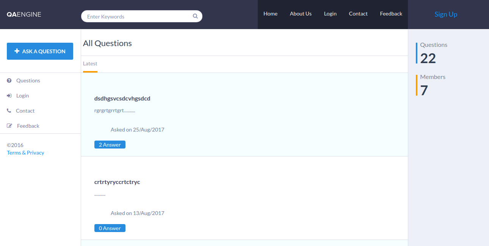
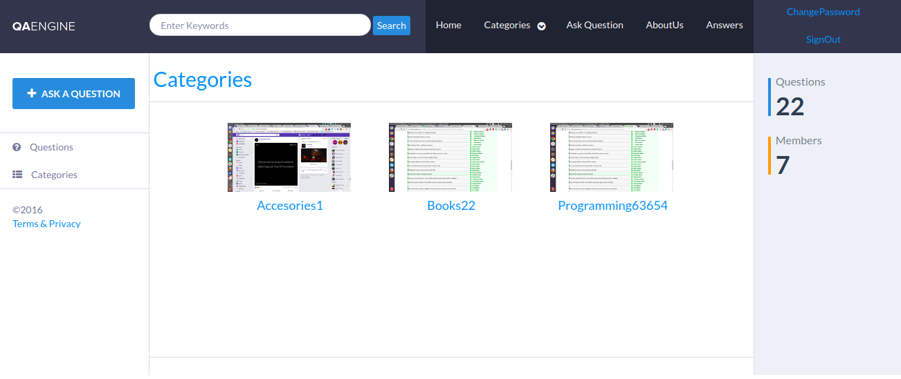
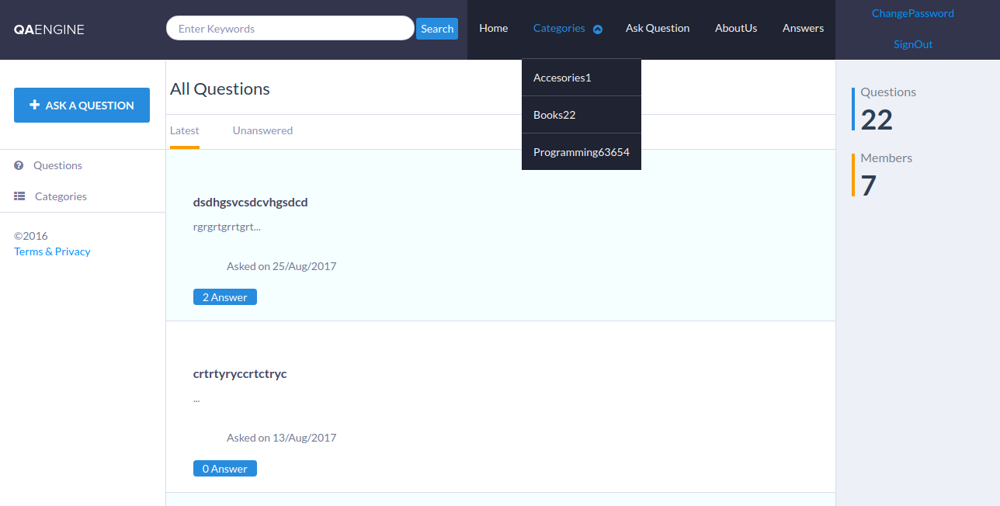
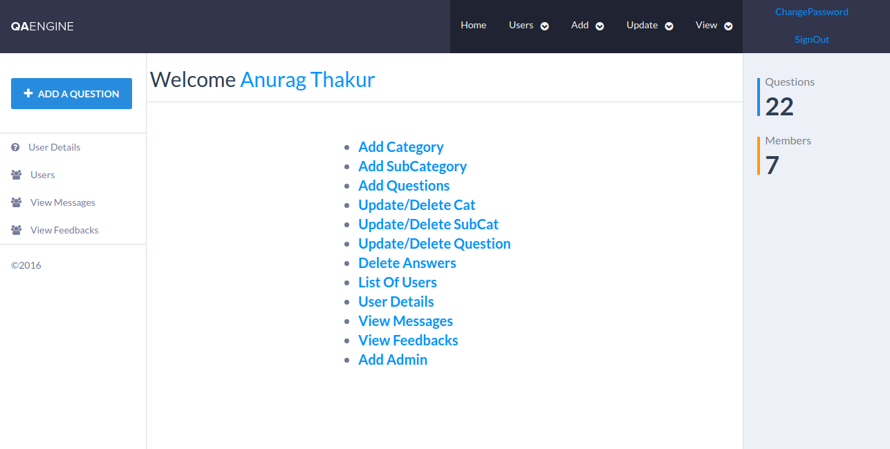
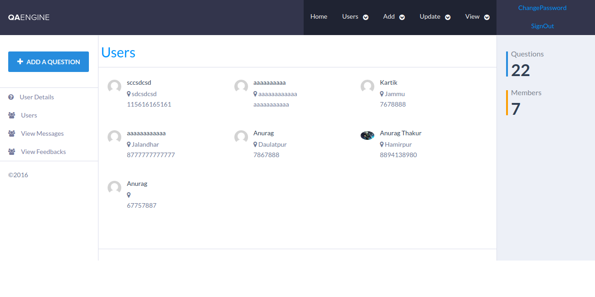
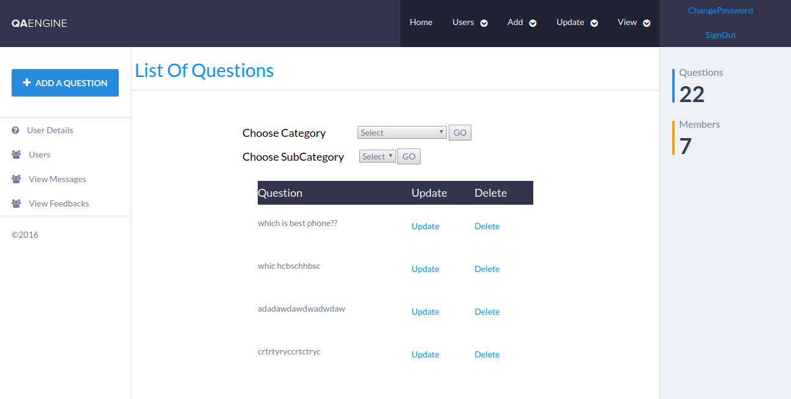

# QA - Question Answering
It is Question Answering site. You can ask questions,see answers,give your answers.You can see questions according to categories and subcategories. It is written entirely in HTML/CSS/JS and PHP with MySQL.

## Home Page
Here, you see all latest questions and there total number of answers given by others.You can see very less part of answer.If you want to see the answer you have to login first.If want to ask question also you have to login first.

## HomePage
It's dashboard where details of all exams can be seen and you can seen how many exams are in progress or upcoming or completed. 

## ExamDetails
Here, you added the details of exams and according to your start and end time date of exam it calculated total time peroid of exam.

## Questions
Here, you can add questions like Objective,true-false,MCQ and set marks to each questions and there answer also.

## Final Exam 
Here,you get final exam paper or sheet.You can save it or add new group of users or previous saved one groups also. 

## Add Groups
Here, you can add users to group.Type result of all users are shown in dynamic way or you can add user to group.  

These are basic features of my work, there are others also you can check it on given link http://online-xam.herokuapp.com/
